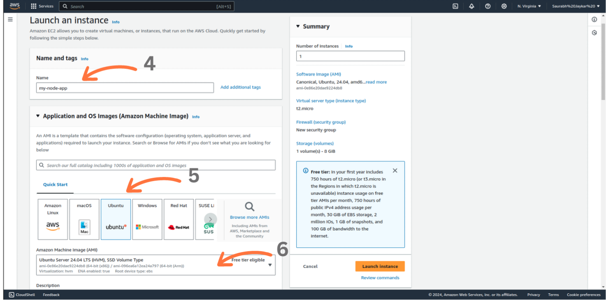
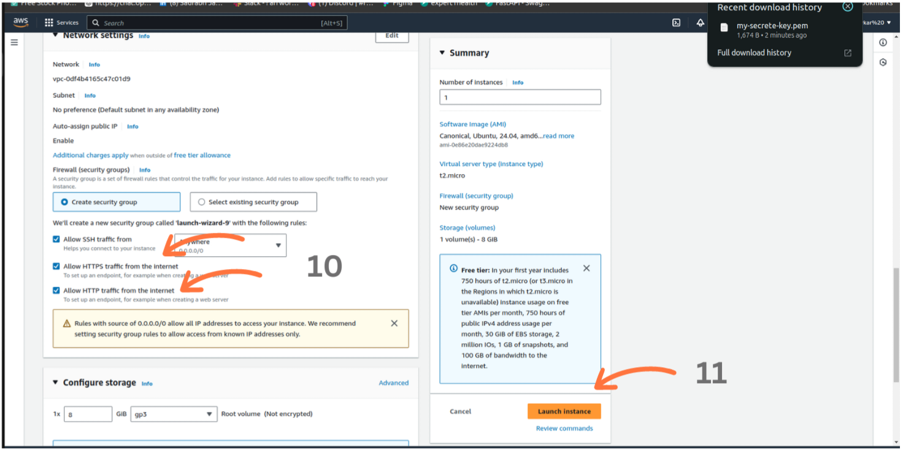
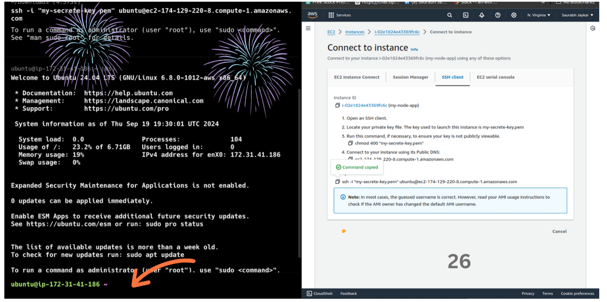
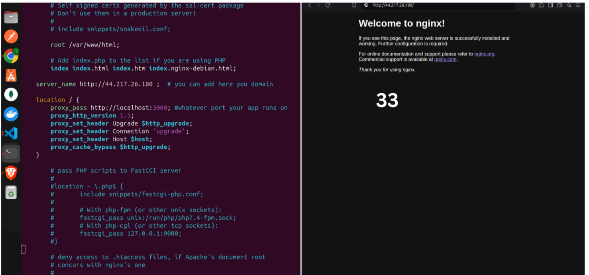

## FREE SSL, NGINX | Node js HTTPS Server

---

**In this tutorial, we will walk through the complete process of deploying a Node.js application on an `AWS EC2 `instance using `PM2 for process management`. Additionally, we will configure an NGINX reverse proxy for routing requests to the application and secure the deployment with a free SSL certificate from Let's Encrypt. This guide ensures a production-ready setups , along with HTTPS support for secure communication.**

---

### Step 1: Create an AWS Account

- First, you need to create an AWS account. Go to the AWS website and sign up for a free account. You will need to provide some basic information about yourself and your company.


---

### Step 2: Create an EC2 Instance

- An EC2 (Elastic Compute Cloud) instance is a virtual server in Amazon’s cloud where you can run your applications. Follow these steps to create an EC2 instance:

1. **Navigate to the EC2 Dashboard**:

   - Once logged into your AWS account, go to the EC2 service by searching "EC2" in the AWS Management Console.

   

2. **Launch a New EC2 Instance**:

   - Click the **"Launch Instance"** button.
     
   - Choose the **Amazon Machine Image (AMI)**. For Node.js deployments, select a Linux-based AMI, such as **Ubuntu Server 24.04 LTS**.
     

3. **Select an Instance Type**:

   - For development or small-scale production, the **t2.micro** instance (eligible for the AWS Free Tier) is recommended.
   - This instance provides 1 vCPU and 1GB of memory.
     

4. **Create a Key Pair**:

   - If you don’t already have a key pair, click **Create new key pair**.
     

   - Select **RSA** as the key type and **.pem** as the format. This key pair will be used to securely connect to your instance.
   - Download the `.pem` file and store it in a safe location. You’ll need this to access the instance using SSH.
     

   - If you already have an existing key pair, you can select it from the dropdown.

5. **Configure Instance Details**:

   - Choose the default settings unless you have specific network preferences. Ensure you place your instance in the right VPC and subnet.
     

6. **Add Storage**:

   - The default storage size is typically sufficient for most Node.js applications, but you can adjust it if your project requires additional space. For standard Node.js deployments, 8GB to 16GB of storage is generally recommended to ensure smooth operation and accommodate application files, logs, and other data.

   - Your Instance is Ready 🎉.
     

---

### Step 3 : Assign an Elastic IP

- An Elastic IP (EIP) is a static IP address that you can use to connect to
  your instance from anywhere in the world. Follow these steps to assign an EIP

1. **Assign an Elastic IP**:

   - After launching the instance, navigate to the **Elastic IPs** section in the EC2 Dashboard.
     
   - Click **Allocate Elastic IP address** to reserve a static public IP.
     
     
     
   - Once allocated, select the Elastic IP, click **Actions**, and choose **Associate Elastic IP**.
   - In the association options, select your EC2 instance. This ensures that your instance retains the same public IP address, even after a reboot, making it easier to connect and manage.
     

---

### Step 3 : Configure Security Groups

1. **Navigate to Security groups**:

   - In the EC2 dashboard, navigate to the **Instances** section.
   - Click on the **Security** tab.
   - Click on the **Security Groups** tab.
     
   - Click on the **Edit Inbound Rules** tab.
     

2. **Configure Security Groups**:

   Security groups act as a virtual firewall. Add the following inbound rules:

   - **SSH (Port 22)**: Allows you to connect to the instance using SSH.
   - **HTTP (Port 80)**: Required for regular web traffic.
   - **HTTPS (Port 443)**: For secure web traffic after SSL is configured.
   - Optionally, add **Custom TCP rules** for any other required ports.

     - For example:
     - **Backend API**: If your server is listening on ports like **8000** or **5000**, add those ports to allow access.
     - **Frontend (React)**: If you're running a React app on port **3000**, add a rule for port **3000** to access the frontend.
       
       - save 🎉

---

### Step 4 : Connect to Your Instance

- **Connect to your instance using SSH:**

  - After assigning an Elastic IP address to your instance, connect to it via SSH by following these steps:

    

    ```bash
    ssh -i "path-to-your-key.pem" ubuntu@your-instance-public-ip
    ```

  - Replace `"path-to-your-key.pem"` with the path to your private key file.
  - Replace `"your-instance-public-ip"` with the public IP address of your instance.
  - You should now be logged in to your instance.
    

---

### Step 5 : Install Node.js on Virtual Machine

- **Install Node.js**:

  To install Node.js on your instance, run the following commands:

  ```bash
  curl -sL https://deb.nodesource.com/setup_18.x | sudo -E bash -
  sudo apt install -y nodejs
  node --version
  ```

  - This will install Node.js version 18.x.
  - Verify the installation by checking the Node.js version with the `node --version` command.
    

---

### Step 6 : Clone Your Project ans install Dependencies

- **Clone your project**:

  To clone your project from a Git repository, use the following command:

  ```bash
  git clone https://github.com/your-username/your-repository.git
  ```

  - Replace `your-username` with your GitHub username (or relevant Git hosting service).
  - Replace `your-repository` with the name of your repository.

  Once the project is cloned, navigate into the project directory:

  ```bash
  cd your-repository
  ```

  - Replace `your-repository` with the name of your cloned repository.

---

- **Install project dependencies**:

  After cloning the repository, run the following command to install the necessary dependencies:

  ```bash
  npm install
  ```

  This will install all the required Node.js modules listed in your `package.json` file.
  

---

### Step 7 : Install PM2 Globally and Test Your App

- **PM2 is a process manager for Node.js applications that helps you keep your apps running continuously, even after a server restart. It allows you to manage, monitor, and scale applications easily with commands for starting, stopping, restarting, and viewing logs. PM2 also provides features like automatic startup on boot, log management, and process clustering for better performance.**
- **Install PM2 globally**:

  Use the following command to install PM2 globally on your server:

  ```bash
  sudo npm install pm2@latest -g
  ```

  PM2 is a process manager that helps you manage and keep your Node.js application running in the background.

---

- **Start your Node.js application using PM2**:

  1. Navigate to the directory where your Node.js app is located:

  ```bash
  cd /path/to/your/app
  ```

  2. Start your application with PM2:

  ```bash
  pm2 start server.js -- name my-node-app
  ```

  

  Replace `server.js ` with the entry point file of your Node.js application.

---

- **Check the status of your application**:

  To view the status of your app, run:

  ```bash
  pm2 list
  ```

  This will display all running applications managed by PM2.

---

- **Set PM2 to start on boot**:

  To ensure that PM2 and your app start automatically when the server restarts, run the following command:

  ```bash
  pm2 startup
  ```

  Then, follow the instructions printed on your terminal to enable PM2 at startup.

---

- **Save the current PM2 process list**:

  After starting your application, save the PM2 process list to restore it on reboot:

  ```bash
  pm2 save
  ```

---

- **View application logs**:

  To monitor the logs of your Node.js app, use the following command:

  ```bash
  pm2 logs
  ```

  

  This will allow you to track logs for debugging or monitoring purposes.

- **Other PM2 Commands**

- **Show details of an app**:

  To view detailed information about a specific application, use:

  ```bash
  pm2 show app
  ```

  Replace `app` with the name or ID of your application.

---

- **Check the status of all applications**:

  To see the status of all running applications:

  ```bash
  pm2 status
  ```

---

- **Restart an application**:

  To restart a specific app:

  ```bash
  pm2 restart app
  ```

  Replace `app` with the name or ID of your application.

---

- **Stop an application**:

  To stop a running application:

  ```bash
  pm2 stop app
  ```

  Replace `app` with the name or ID of your application.

---

- **Clear logs**:

  To clear all logs maintained by PM2:

  ```bash
  pm2 flush
  ```

---

**Note:** The above commands are for the basic usage of PM2. For more advanced features
and options, you can refer to the official PM2 documentation.

---

- **Project Running on IP and Port**

- Your project is now running on the specified IP and port:

  

### Step 8 : Install NGINX and Configure

- **Why Use NGINX?**

1.  Reverse Proxy: NGINX acts as a reverse proxy, allowing you to manage traffic to your Node.js app efficiently. It forwards requests and handles load balancing, improving performance and reliability.
2.  Static File Serving: NGINX is excellent at serving static files (like images, CSS, and JavaScript) quickly and efficiently, freeing up your Node.js application to handle dynamic content.
3.  SSL Termination: NGINX can handle SSL/TLS encryption, allowing secure HTTPS connections while offloading this work from your Node.js application.
4.  Connection Handling: NGINX can handle a large number of concurrent connections, which is beneficial for high-traffic applications, ensuring better resource management.
5.  Caching: NGINX can cache responses to reduce load on your backend and speed up response times for users.

- **Install NGINX**:

  To install NGINX on your server, run the following command:

  ```bash
  sudo apt install nginx
  ```

  

---

- **Configure NGINX**:

  1. Open the NGINX default site configuration file using `vim` (or any text editor):

  ```bash
  sudo vim /etc/nginx/sites-available/default
  ```

  2. Modify the configuration to serve your Node.js application. Update the `server` block as needed (an example config is provided below):

  ```nginx
      server_name yourdomain.com www.yourdomain.com;

    location / {
        proxy_pass http://localhost:8001; #whatever port your app runs on
        proxy_http_version 1.1;
        proxy_set_header Upgrade $http_upgrade;
        proxy_set_header Connection 'upgrade';
        proxy_set_header Host $host;
        proxy_cache_bypass $http_upgrade;
    }
  ```

  - Replace `your-domain.com` with your actual domain or `IP address`.
    

---

- **Enable the configuration and restart NGINX**:

  1. Check for any syntax errors in your NGINX configuration:

  ```bash
  sudo nginx -t
  ```

  2. If there are no errors, restart NGINX to apply the changes:

  ```bash
  sudo nginx -s reload

  ```

---


Now, NGINX should be serving your Node.js application. You can access it via your domain or IP.

### Step 9: Add SSL with Let's Encrypt

- To add SSL with Let's Encrypt, you need to install the Certbot package on your Ubuntu server. Follow these steps:

  1. **Add the Certbot PPA**:

  ```bash
  sudo add-apt-repository ppa:certbot/certbot
  ```

  2. **Update the package list**:

  ```bash
  sudo apt-get update
  ```

  3. **Install Certbot and the NGINX plugin**:

  ```bash
  sudo apt-get install python3-certbot-nginx
  ```

  4. **Obtain an SSL certificate**:

  Use the following command to configure SSL for your domain:

  ```bash
  sudo certbot --nginx -d yourdomain.com -d www.yourdomain.com
  ```

  - Replace `yourdomain.com` with your actual domain name.

  5. **Test the renewal process**:

  Certificates from Let's Encrypt are valid for 90 days. To ensure your renewal process works, you can run:

  ```bash
  certbot renew --dry-run
  ```

  This command simulates the renewal process to verify that it will work when your certificate is close to expiration.
