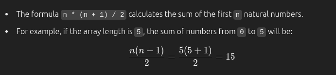

# 1. Palindrome Checker

Given an integer x, return true if x is a
palindrome, and false otherwise.

- Example 1:

Input: x = 121
Output: true
Explanation: 121 reads as 121 from left to right and from right to left.

- Example 2:

Input: x = -121
Output: false
Explanation: From left to right, it reads -121. From right to left, it becomes 121-. Therefore it is not a palindrome.

- Example 3:

Input: x = 10
Output: false
Explanation: Reads 01 from right to left. Therefore it is not a palindrome.

## Function Definition

```javascript
/**
 * Function to check if a number is a palindrome.
 * @param {number} x - The integer to check.
 * @returns {boolean} - Returns true if the integer is a palindrome, otherwise false.
 */
const isPalindrome = function (x) {
  return x === +x.toString().split("").reverse().join("");
};

// Example Usage
const res = isPalindrome(10);
console.log(res); // Output: false
```

# 2. Fibonacci Number

**Difficulty:** Easy

### Problem Description

The Fibonacci numbers, commonly denoted F(n), form a sequence called the Fibonacci sequence, such that each number is the sum of the two preceding ones, starting from 0 and 1. That is,

- F(0) = 0, F(1) = 1
- F(n) = F(n - 1) + F(n - 2), for n > 1.

Given `n`, calculate F(n).

### Example 1

**Input : `n = 2`**
**Output : `1`**
**Explanation : `F(2) = F(1) + F(0) = 1 + 0 = 1.`**

### Example 2

**Input : `n = 3`**
**Output : `2`**
**Explanation : `F(3) = F(2) + F(1) = 1 + 1 = 2.`**

### Example 3

**Input : `n = 4`**
**Output : `3`**
**Explanation : `F(4) = F(3) + F(2) = 2 + 1 = 3.`**

### Function Definition

```javascript
const fib = function (n) {
  if (n <= 1) return n;

  return fib(n - 1) + fib(n - 2);
};
```

### Explanation

1. Base Case :

- The function starts by checking if `n` is less than or equal to 1.
- If `n` is 0 , the function return 0
- If `n` is 1, the function return 1
- These are the base cases for the Fibonacci sequence and represent the first two numbers in the sequence.

2. Recursive Case :

- If `n` is greater than 1, the function calls itself twice, once with `

# 3. Missing Number

This algorithm is designed to find the missing number in an array of integers where the numbers range from `0` to `n`, but one number is missing.

### Code:

```javascript
/**
 * @param {number[]} nums
 * @return {number}
 */
const missingNumber = function (nums) {
  const expectedSum = (nums.length * (nums.length + 1)) / 2;
  return expectedSum - nums.reduce((acc, num) => acc + num, 0);
};
```

### Step-by-Step Explanation :

- Step 1: Calculating Expected Sum

```js
const expectedSum = (nums.length * (nums.length + 1)) / 2;
```



- Step 2: Calculating Actual Sum

```js
nums.reduce((acc, num) => acc + num, 0);
```

- The reduce function is used to sum all the numbers present in the array.
- For example, if the array is `[0, 1, 3, 4]`, the sum will be : _`0+1+3+4=8`_

- Step 3: Finding the Missing Number

```js
return expectedSum - nums.reduce((acc, num) => acc + num, 0);
```

- The missing number is calculated by subtracting the actual sum from the expected sum.
- In the example above, if the expected sum is`15`and the actual sum is `8`, then the missing number is: _`15−8=7`_

#### Summary :

- Expected Sum: We calculate the expected sum for numbers from `0` to `n` using the formula` n \* (n + 1) / 2`.
- Actual Sum: Using the `reduce` function, we calculate the sum of the numbers present in the array.
- Missing Number: The difference between the expected sum and the actual sum gives the missing number.
