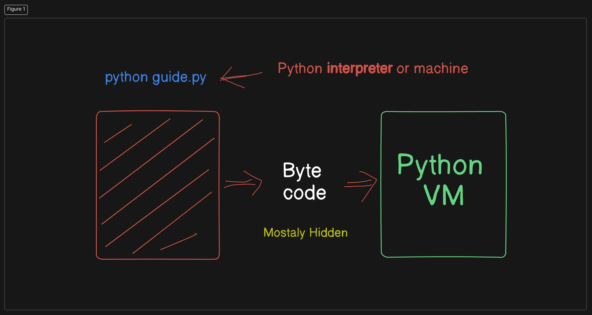

## Python Bytecode and Virtual Machine
When you run a Python script, the process involves several steps to convert your human-readable code into something that the computer can execute efficiently. Here’s a detailed explanation:

1. **Python Source Code** (`.py` file):
    - This is the code you write in a text editor or IDE, saved with a `.py` extension.

2. **Compilation to Bytecode**:
    - When you run a Python script (e.g., `python guide.py`), Python first compiles the source code into bytecode. This step is mostly hidden from the user.
    - **Bytecode**:
        - Bytecode is a low-level, platform-independent representation of your source code.
        - It is designed to be efficient for execution by the Python Virtual Machine (VM).
        - Bytecode files typically have a `.pyc` extension and are stored in a `__pycache__` directory.

3. **Python Virtual Machine (VM)**:
    - The Python VM is responsible for executing the compiled bytecode.
    - The VM interprets the bytecode and performs the necessary operations on the underlying hardware.

4. **Benefits of Bytecode**:
    - **Platform Independence**: Bytecode can be executed on any platform that has a compatible Python VM.
    - **Faster Execution**: Since bytecode is a more compact and efficient representation of your source code, it generally executes faster than interpreting source code directly.

5. **Compiled Python Files** (`.pyc` files):
    - These files contain the bytecode and are often referred to as frozen binaries.
    - They allow Python programs to start faster since the compilation step is skipped.

Happy coding!
