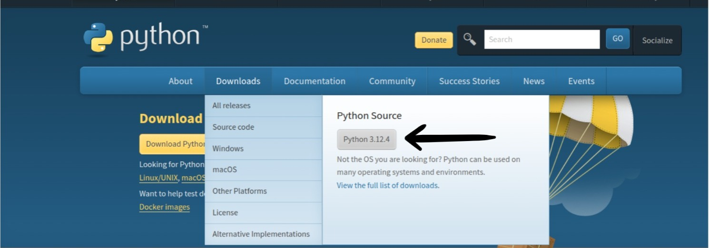

Python is popular programming language known for its simplicity and versatility. It's widely used in web development, data analysis, artificial intelligence, scientific computing and more

## Why Python

- **Easy to Learn** : Python has a clean and readable syntax, making it an excellent choice for beginners.
- **Powerful and Flexible** : Despite its simplicity, Python is very powerful. It supports various programming paradigms, including procedural, object-oriented, and functional programming.
- **Wide Community and Libraries** : Python has Large community and a rich ecosystem of libraries and frameworks, which make it easier to find support and tools for your project

## Getting Started

To start coding in Python, you need to install python on your computer. You can download it from the official [Python website](https://www.python.org/downloads/).



Its automatically detects your machine and gets you the suitable package for your machine.

## Steps to Create and Run "Hello, World!" Program

### 1. Open a Text Editor

You can use any text editor to write your Python code. Some popular choices are:

- Visual Studio Code
- Sublime Text
- Atom
- Notepad (Windows) / TextEdit (Mac)

### 2. Write the Python Code

Create a new file with a `.py` extension and add the following code:

```sh
print("Hello, World!")

```

### 3. Save the File

- Save the file with a `.py` extension, for example, `hello_world.py` .

### 4. How to Run the Python File

- Open a Command Line or Terminal.
- Navigate to the File Location.
- Run the Python Program

Type the following command to run your Python program:

```sh
python3 hello_world.py

```

- If you are using Python 3, you might need to use:

:::note

```sh
python3 hello_world.py

```

:::

If everything is set up correctly, you should see the following output.

```python

Hello, World!

```

## Print Hero Names in Python

Here is an example of how you can print hero names in Python:

### Write the Python Code

Create a new file with a `.py` extension and add the following code:

```python
def print_hero(hero_name):
    print(hero_name)

print_hero("Hulk")
print_hero("Superman")
print_hero("Spider-Man")

```

### Save the File

- Save the file with a `.py` extension, for example, `print_heroes.py`
- Open a Command Line or Terminal.
- Navigate to the File Location.
- Run the Python Program

Type the following command to run your Python program:

```sh
python3 print_heroes.py

```

If everything is set up correctly, you should see the following output.

```python

Hulk
Superman
Spider-Man


```
