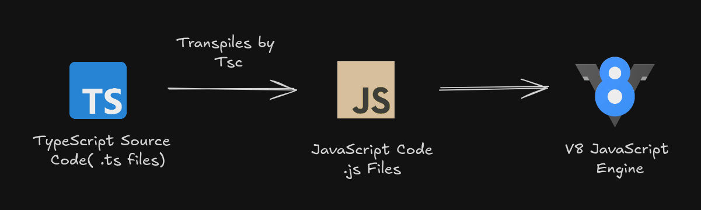

To improve the **image placement** and make the README more organized, let’s ensure the image is aligned correctly with relevant content and doesn't interrupt the logical flow. Here’s a refined version with suggestions for better image positioning:

---

# **TypeScript Inner Working**

**Description**: Discussion about Python inner workings

> This guide provides a basic understanding of how TypeScript works behind the scenes, starting from writing `.ts` files to their execution in a JavaScript engine like V8.

---

### 1. **TypeScript Source Code (`.ts` files)**

- TypeScript is a superset of JavaScript that adds **static typing** and other advanced features.
- Developers write code in **TypeScript files** with the extension `.ts`.
- These files include type annotations, interfaces, and modern JavaScript syntax to improve code quality and reduce runtime errors.

---

### 2. **Transpiling with `tsc` (TypeScript Compiler)**

- The TypeScript code cannot run directly in browsers or JavaScript engines. It must be **transpiled** to JavaScript.
- **`tsc` (TypeScript Compiler)** is the tool responsible for converting TypeScript into **JavaScript** files that browsers and Node.js can understand.
- During the transpilation:
  - Type annotations are removed.
  - TypeScript ensures that type rules are respected, and it flags errors if there are type mismatches.
  - The final output is **JavaScript code** in `.js` files.

---

### 3. **JavaScript Code (`.js` files)**

- Once the TypeScript code is transpiled, the resulting output is **JavaScript** code, which is identical to what developers write directly in JavaScript.
- The JavaScript code generated can run in **any JavaScript environment**—whether in a browser or on the server using Node.js.

---

### 4. **Execution by the V8 JavaScript Engine**

- The final JavaScript code is executed by a **JavaScript engine** like **V8** (used in Google Chrome and Node.js).
- V8 takes the `.js` files, compiles them to machine code, and runs them.
- This ensures that the application behaves exactly as expected, with the added benefit of having caught type-related issues during the development process via TypeScript.

---

### **Summary Flow**

1. **Write**: Code in `.ts` files using TypeScript.
2. **Transpile**: Use `tsc` to convert TypeScript to JavaScript (`.js`).
3. **Execute**: Run the JavaScript code using the **V8 JavaScript Engine** (or any other JavaScript runtime).

---

### **Visual Overview**



The image above shows the complete workflow from writing TypeScript to executing it in a JavaScript engine.

---

## **Installation and Setup**

---

### **Step 1: Install TypeScript**

You need Node.js installed. Then, install TypeScript globally:

```bash
npm install -g typescript
```

### **Step 2: Verify Installation**

Check if TypeScript is installed:

```bash
tsc --version
```

### **Step 3: Create Your First TypeScript File**

Create a file named `index.ts` with the following code:

```ts
let greeting: string = "Hello, TypeScript!";
console.log(greeting);
```

### **Step 4: Compile the TypeScript Code**

Transpile the TypeScript file to JavaScript:

```bash
tsc index.ts
```

This will generate an `index.js` file with the compiled JavaScript code.

### **Step 5: Run the JavaScript Code**

Execute the compiled JavaScript file:

```bash
node index.js
```

---

## **Resources for Learning More**

- [TypeScript Documentation](https://www.typescriptlang.org/docs/)
- [TypeScript Playground](https://www.typescriptlang.org/play)

---

## **Conclusion**

TypeScript improves JavaScript development with static typing, better tooling, and maintainable code. It’s easy to get started and can significantly reduce bugs in your applications.

Happy coding! 🎉

---
